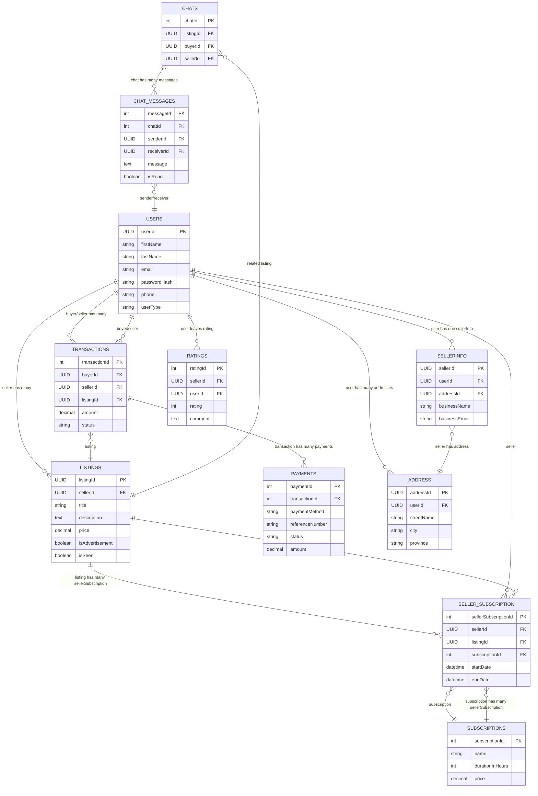

# ERD (Mermaid)

Below is a Mermaid ERD diagram showing entities and relationships for the project. You can render this in VS Code Mermaid preview or on mermaid.live.

```mermaid
erDiagram
    USERS {
        UUID userId PK
        string firstName
        string lastName
        string email
        string passwordHash
        string phone
        string userType
    }

    LISTINGS {
        UUID listingId PK
        UUID sellerId FK
        string title
        text description
        decimal price
        boolean isAdvertisement
        boolean isSeen
    }

    SELLERINFO {
        UUID sellerId PK
        UUID userId FK
        UUID addressId FK
        string businessName
        string businessEmail
    }

    SUBSCRIPTIONS {
        int subscriptionId PK
        string name
        int durationInHours
        decimal price
    }

    SELLER_SUBSCRIPTION {
        int sellerSubscriptionId PK
        UUID sellerId FK
        UUID listingId FK
        int subscriptionId FK
        datetime startDate
        datetime endDate
    }

    TRANSACTIONS {
        int transactionId PK
        UUID buyerId FK
        UUID sellerId FK
        UUID listingId FK
        decimal amount
        string status
    }

    PAYMENTS {
        int paymentId PK
        int transactionId FK
        string paymentMethod
        string referenceNumber
        string status
        decimal amount
    }

    RATINGS {
        int ratingId PK
        UUID sellerId FK
        UUID userId FK
        int rating
        text comment
    }

    CHATS {
        int chatId PK
        UUID listingId FK
        UUID buyerId FK
        UUID sellerId FK
    }

    CHAT_MESSAGES {
        int messageId PK
        int chatId FK
        UUID senderId FK
        UUID receiverId FK
        text message
        boolean isRead
    }

    ADDRESS {
        UUID addressId PK
        UUID userId FK
        string streetName
        string city
        string province
    }


    USERS ||--o{ LISTINGS : "seller has many"
    USERS ||--o{ TRANSACTIONS : "buyer/seller has many"
    USERS ||--o{ RATINGS : "user leaves rating"
    USERS ||--o{ SELLERINFO : "user has one sellerInfo"
    USERS ||--o{ ADDRESS : "user has many addresses"

    LISTINGS ||--o{ SELLER_SUBSCRIPTION : "listing has many sellerSubscription"
    SUBSCRIPTIONS ||--o{ SELLER_SUBSCRIPTION : "subscription has many sellerSubscription"
    SELLER_SUBSCRIPTION }o--|| USERS : "seller"
    SELLER_SUBSCRIPTION }o--|| LISTINGS : "listing"
    SELLER_SUBSCRIPTION }o--|| SUBSCRIPTIONS : "subscription"

    TRANSACTIONS ||--o{ PAYMENTS : "transaction has many payments"
    TRANSACTIONS }o--|| USERS : "buyer/seller"
    TRANSACTIONS }o--|| LISTINGS : "listing"

    CHATS ||--o{ CHAT_MESSAGES : "chat has many messages"
    CHAT_MESSAGES }o--|| USERS : "sender/receiver"
    CHATS }o--|| LISTINGS : "related listing"

    SELLERINFO }o--|| ADDRESS : "seller has address"
```
